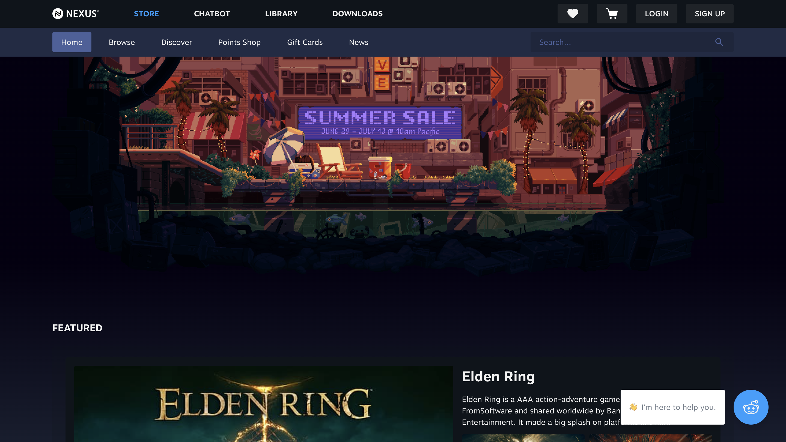
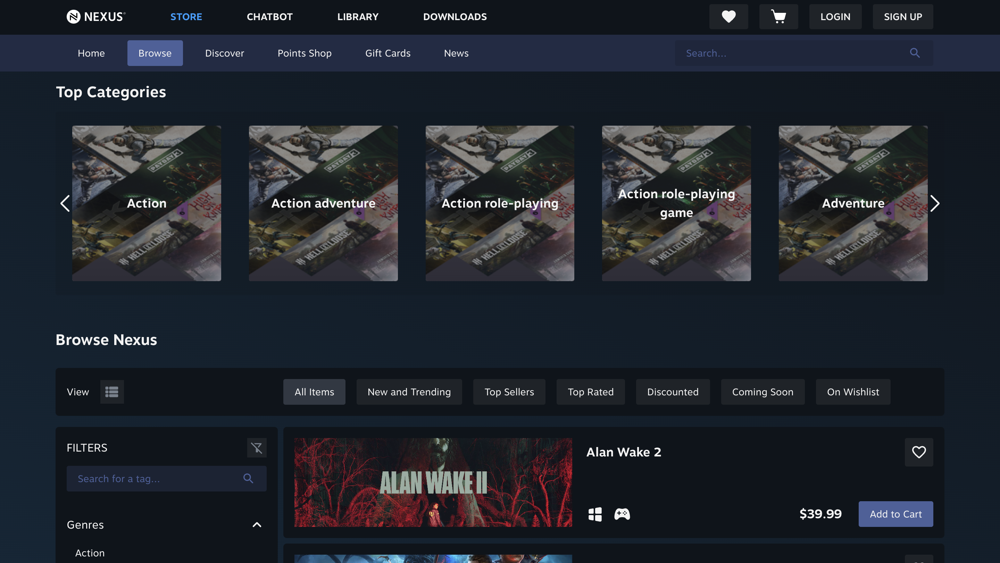
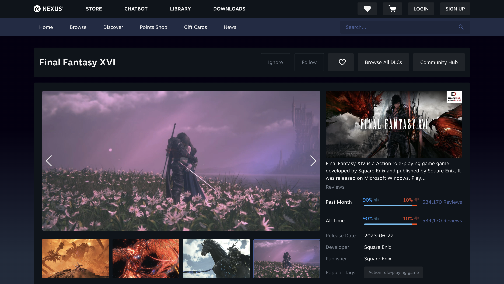
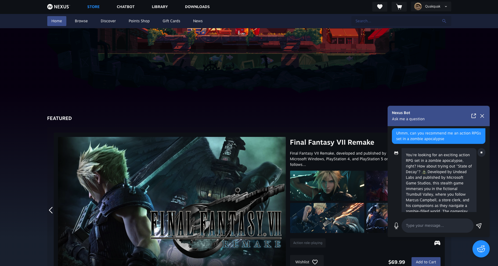
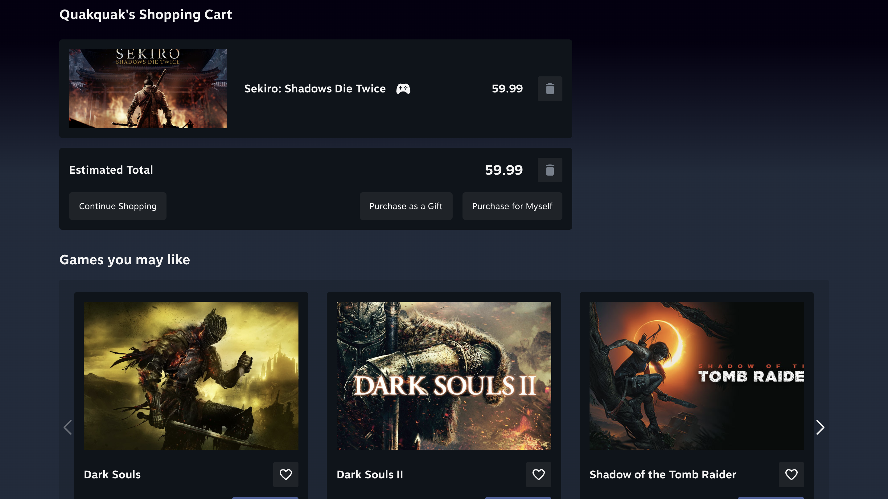

# Nexus - Intelligent Game Store Platform

Nexus is a modern game store platform featuring an AI-powered chatbot to enhance user experience and game discovery. Built with Vue 3, TypeScript, and Vite.


## Features

- 🎮 Curated game store with advanced filtering and search
- 🤖 AI-powered chatbot (RAG)
- 🤖 AI-powered game recommendations (content-based recommendation with Inverted File Index (Index-IVF))
- 👤 User profiles and game libraries
- 📱 Responsive design for all devices

### Project Structure

- Frontend: [this repository](https://github.com/blkhanhlinh/Nexus)
- Backend: [Nexus-Backend](https://github.com/LongNguyen1101/game_management_service_nexus_project_cs313)
- AI Service: [Nexus-AI](https://github.com/ngocnd2402/nexus-ai-service)

## Screen Previews

### Home Page

Modern landing page showcasing featured games and latest releases.


### Game Store

Browse and filter through our extensive game collection.


### Game Details

Detailed game information with screenshots, reviews, and purchase options.


### AI Chatbot Interface

Get personalized game recommendations through our intelligent chatbot.


### Recommendation

Get personalized game recommendations through our intelligent chatbot.


## Technology Stack

- Frontend: Vue 3 + TypeScript
- Build Tool: Vite
- FE Framework/Library: Tailwind CSS, GSAP, Swiper, Pinia, Axios
- AI Integration: RAG
- Database: MongoDB

## Getting Started

### Prerequisites

- Node.js (v16 or higher)
- npm or yarn

### Installation

Clone the repository

```bash
git clone https://github.com/your-repo/nexus.git
```

Install dependencies

```bash
npm install
```

Run the development server

```bash
npm run dev
```

### Build for production

```bash
npm run build
```

## Development Setup

Recommended IDE setup:

- [VS Code](https://code.visualstudio.com/) with the following extensions:
  - [Vue - Official](https://marketplace.visualstudio.com/items?itemName=Vue.volar)
  - TypeScript Vue Plugin (Volar)

## Contributing

1. Fork the repository
2. Create your feature branch (`git checkout -b feature/AmazingFeature`)
3. Commit your changes (`git commit -m 'Add some AmazingFeature'`)
4. Push to the branch (`git push origin feature/AmazingFeature`)
5. Open a Pull Request

## License

This project is licensed under the [MIT License](LICENSE)

## Contact

Project Link: [https://github.com/blkhanhlinh/Nexus](https://github.com/blkhanhlinh/Nexus)
